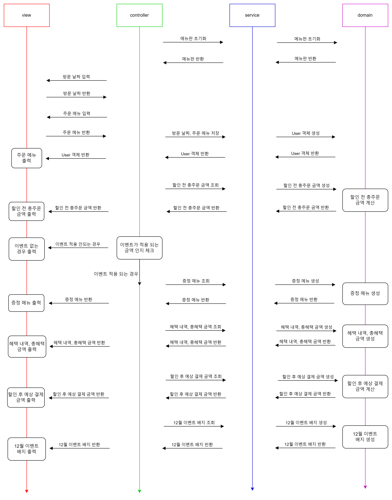

# 🎄**미션 - 크리스마스 프로모션**

## 👀 문제 확인하기

- 우아한테크코스 4주차 과제 중 '**크리스마스 프로모션**'의 구현 기능 목록, 플로우 차트를 담은 문서입니다.

---

## 🌟 구현 기능 목록

### ✔ 입력값 검증 기능

- 입력값이 공백으로만 이루어져 있는지 검증한다.
- 입력값이 비어 있는지 검증한다.
- 입력값이 null인지 검증한다.
- 식당 예상 방문 날짜 입력
    - 1 이상 31 이하의 숫자인지 검증한다.
        - 1 이상 31 이하의 숫자가 아닌 경우, "[ERROR] 유효하지 않은 날짜입니다. 다시 입력해 주세요."라는 에러 메시지 출력
- 메뉴 입력
    - 음료만 주문 했는지 검증한다.
        - 음료만 주문 했을 경우 에러 메시지 출력
    - 주문한 메뉴가 20개 이하인지 검증한다.
        - 20개 초과면 에러 메시지 출력
    - 고객이 메뉴판에 없는 메뉴를 입력했는지 검증한다.
        - 없는 메뉴를 입력했을 경우 "[ERROR] 유효하지 않은 주문입니다. 다시 입력해 주세요."라는 에러 메시지 출력
    - 입력한 메뉴의 개수는 1 이상의 숫자인지 검증한다.
        - 메뉴의 개수가 1 이상의 숫자가 아닌 경우 "[ERROR] 유효하지 않은 주문입니다. 다시 입력해 주세요."라는 에러 메시지 출력
    - 메뉴 형식이 예시와 다른지 검증한다.
        - 메뉴 이름과 가격이 -로 구분되었는지 검증한다.
        - 메뉴들이 쉼표(,)를 기준으로 구분되었는지 검증한다.
        - -사이와 , 사이에 공백이 있는지 검증한다.
        - 검증 실패시 "[ERROR] 유효하지 않은 주문입니다. 다시 입력해 주세요."라는 에러 메시지 출력
    - 중복 메뉴를 입력했는지 검증한다.
        - (e.g. 시저샐러드-1,시저샐러드-1)
        - 중복 메뉴 입력인 경우 "[ERROR] 유효하지 않은 주문입니다. 다시 입력해 주세요."라는 에러 메시지 출력

### ✔ 메뉴판 초기화 기능

- 메뉴의 이름과 가격을 정해진 형식으로 초기화 한다.
- 메뉴 카테고리를 만들어서 해당 카테고리에 속하는 메뉴들을 저장한다.

### ✔ 방문 날짜, 주문 메뉴 저장 기능

- 사용자가 입력한 방문 날짜와 주문 메뉴를 User 객체 생성 후 해당 객체에 저장 후 객체를 반환한다.

### ✔ 할인 전 총주문 금액 계산 기능

- User 객체에 저장 되어 있는 주문 메뉴에서 메뉴 이름을 통해 메뉴 개수 조회
- 메뉴판에서 메뉴 이름을 통해 메뉴 가격 조회
- 조회한 메뉴 개수와 메뉴 가격을 통해 할인 전 총주문 금액을 계산한다.

### ✔ 이벤트가 적용 되는 금액 체크 기능

- 할인 전 총주문 금액이 만원 이상이면 이벤트 상위 컨트롤러 호출해서 이벤트 진행하기

### ✔ 증정 메뉴 생성 기능

- 할인 전 총주문 금액이 12만 원 이상일 때, 샴페인 1개 증정한다.

### ✔ 혜택 내역 생성 기능

- 크리스마스 디데이 할인 금액 계산
    - 이벤트 기간: 2023.12.1 ~ 2023.12.25
    - 1,000원으로 시작하여 크리스마스가 다가올수록 날마다 할인 금액이 100원씩 증가
    - 방문 날짜가 1 ~ 25인지 체크
    - 방문 날짜를 가지고 얼마나 할인 했는지 계산
        - 25일이면 ⇒ (25 - 2 + 1) * 100 + 1000(기본 천원)
- 평일 할인 금액 계산
    - 평일에는 디저트 메뉴를 메뉴 1개당 2,023원 할인
    - 방문 날짜가 평일인지 체크(일요일~목요일)
    - 주문한 메뉴가 디저트인지 체크
    - 개당 2023원 할인
- 주말 할인(금요일, 토요일): 주말에는 메인 메뉴를 메뉴 1개당 2,023원 할인
    - 방문 날짜가 주말인지 체크
    - 주문한 메뉴가 메인 메뉴인지 체크
    - 개당 2023원 할인
- 특별 할인:
    - 방문 날짜가 이벤트 달력에 별이 있는 날짜인지 체크
    - 총주문 금액에서 1000원 할인
- 이벤트 기간
    - '크리스마스 디데이 할인'을 제외한 다른 이벤트는 2023.12.1 ~ 2023.12.31 동안 적용

### ✔ 총혜택 금액 계산 기능

- 총혜택 금액 = 할인 금액의 합계 + 증정 메뉴의 가격

### ✔ 할인 후 예상 결제 금액 계산

- 할인 후 예상 결제 금액 = 할인 전 총주문 금액 - 할인 금액

### ✔ 12월 이벤트 배지 생성 기능

- 총혜택 금액에 따라 이벤트 배지의 이름을 생성
- 5천 원 이상: 별
- 1만 원 이상: 트리
- 2만 원 이상: 산타

### ✔ 출력 기능

- 주문 메뉴 출력
    - 주문 메뉴의 출력 순서는 자유롭게 출력
- 할인 전 총주문 금액 출력
- 이벤트 없는 경우 출력
- 증정 메뉴 출력
    - 증정 이벤트에 해당하지 않는 경우, 증정 메뉴 "없음"으로 출력
- 혜택 내역
    - 적용된 이벤트가 하나도 없다면 혜택 내역 "없음" 으로 출력
        - 총혜택 금액이 0인 경우 “없음”으로 출력
    - 고객에게 적용된 이벤트 내역만 출력
        - 혜택 내역의 할인 금액이 0원이 아닌 경우 혜당 혜택 내역 출력
    - 혜택 내역에 여러 개의 이벤트가 적용된 경우, 출력 순서는 자유롭게 출력
- 총혜택 금액 출력
- 할인 후 예상 결제 금액 출력
- 12월 이벤트 배지 출력
    - 이벤트 배지가 부여되지 않는 경우, "없음" 출력

---

## 💡 플로우 차트

